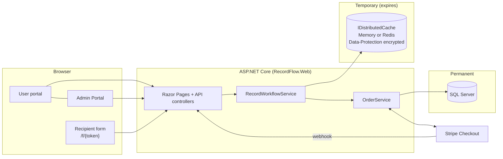
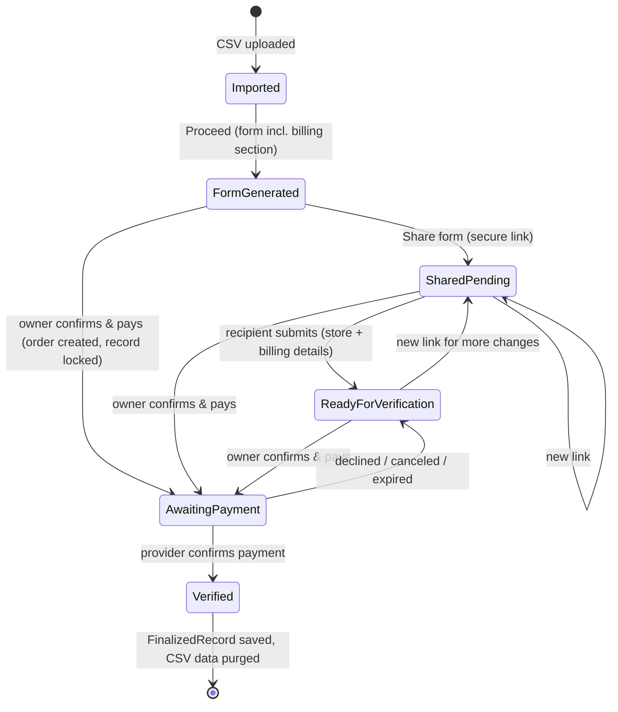
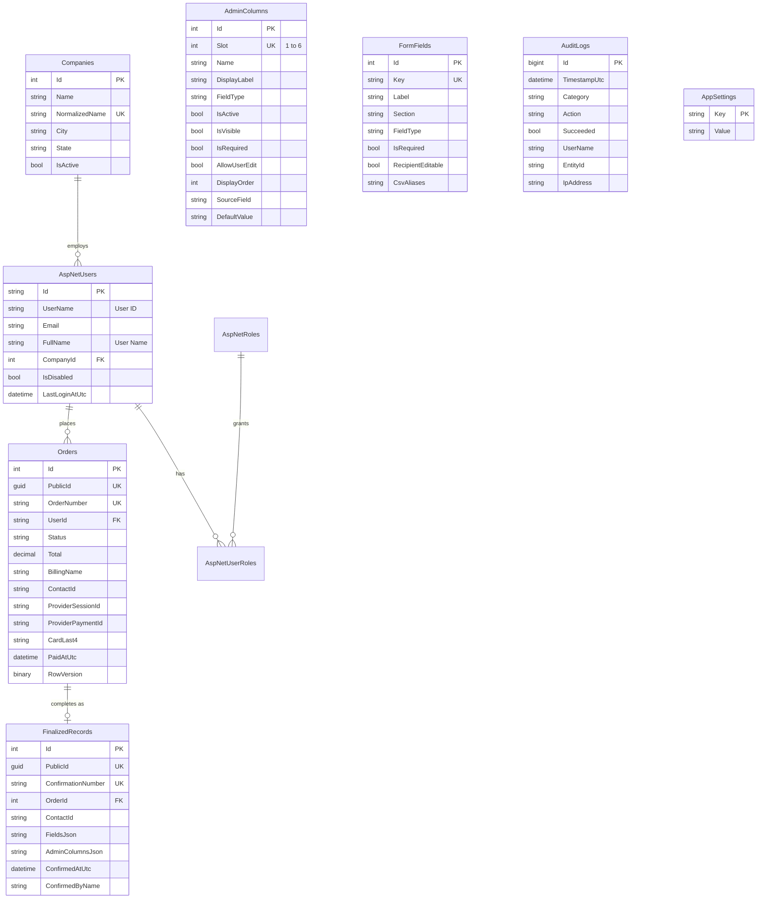

# Architecture

## Overview

| Project | Responsibility |
|---|---|
| `RecordFlow.Core` | Entities, the temporary workspace model, interfaces, and pure logic with no I/O: `FormBuilder`, `AdminColumnResolver` (dynamic column visibility), `FieldValidator`, `PricingCalculator`, `SecureTokens`, `CsvSanitizer`, `UsStates`. |
| `RecordFlow.Infrastructure` | `ApplicationDbContext` + migrations, `DistributedWorkspaceStore`, `CsvImportService`, `StripePaymentProvider` / `SimulatedPaymentProvider`, `OrderService`, `RecordWorkflowService`, SMTP/dev email, `AuditLogger`, settings and config caches. |
| `RecordFlow.Web` | Razor Pages for the user portal and account, the separate `Admin` area, the anonymous recipient form, JSON API (`/api/workspace/...`), Stripe webhook, security middleware, static assets. |

## Temporary workspace vs. permanent database

| Data | Where | Lifetime |
|---|---|---|
| Uploaded CSV file | Never stored. Read from the request's in-memory buffer (`FormOptions.MemoryBufferThreshold` = max upload size, so ASP.NET Core never spools it to a temp file). | Request only |
| Parsed CSV rows, working records, in-progress form values, share-token index | `IDistributedCache` (`rf:ws:*`, `rf:wsu:*`, `rf:share:*`), JSON encrypted with Data Protection | Sliding idle timeout (default 2 h) **and** absolute lifetime (default 24 h); deleted immediately on sign-out, "End session", a new upload, or account disable. Raw CSV cells are purged from a record as soon as it is confirmed. |
| Users, roles, companies | SQL Server (Identity tables, `Companies`) | Permanent |
| Six admin column definitions, form field definitions, pricing | SQL Server (`AdminColumns`, `FormFields`, `AppSettings`) | Permanent |
| Orders / payment status (no card data) | SQL Server (`Orders`) | Permanent |
| Finalized business records (final confirmed values only) | SQL Server (`FinalizedRecords`) | Permanent |
| Call log: each call's start/end, outcome, notes, caller, Contact ID and store name (no other CSV data) | SQL Server (`CallLogs`), written as the call happens | Permanent |
| Audit log | SQL Server (`AuditLogs`) | Permanent |
| Data Protection key ring | SQL Server (`DataProtectionKeys`), optionally encrypted with a certificate | Permanent |

Expired entries are evicted by the cache itself (memory cache scan / Redis TTL), so no clean-up job is required.

### Isolation

- Each user has at most one workspace, found through `rf:wsu:{userId}`. Every read/update checks `OwnerUserId`.
- Record keys are random 96-bit values, but they are **only resolved inside the caller's own workspace**, so a key
  belonging to someone else is simply "not found" (the API answers 410/400, pages redirect to the dashboard).
- Recipients never get a workspace id or record key. Their link carries a 256-bit token; the cache stores only its
  SHA-256 hash, which maps to exactly one record. The token is compared in constant time, is single-use, and is
  revoked on regeneration, confirmation, new upload, sign-out and expiry.
- Concurrent updates to one workspace (owner + recipient) are serialized with striped async locks.
  With Redis and several web servers, enable session affinity (ARR affinity) or replace the lock with a Redis lock.

## Workflow state machine (per working record)

The dashboard is a call desk: clicking a store (or **Next call**) opens a popup with all its CSV values and starts its
first call; **End call** sets the close time and **Call again** adds another call. Each record keeps a `Calls` list
(start/end), the latest call drives the Time / Close Time columns, and only one call is active at a time. Every call is also
saved to the permanent `CallLogs` table (keyed by the call's id) when it starts, ends or gets an outcome; uploading a
list again brings back that caller's earlier calls for the same Contact IDs, ending a session closes any open call, and
admins see everything under **Admin Portal → Call log** (filter + CSV export). Each call can carry an outcome (Interested, Not interested, Call back, No answer, Left
voicemail, Wrong number) and notes; **Next call** picks stores never called first, then follow-ups (call back / no
answer / voicemail). Valid U.S. phone numbers in the row are shown as `tel:` click-to-call links. When bank payments are enabled, the billing section includes a **Payment method**
choice for the recipient, which pre-selects the method on the Verify page.

The order's status in SQL Server is the source of truth for payment. Pages reconcile the record status with the
order on every load (and the dashboard refreshes records awaiting payment), so a webhook that arrives while the user
is away completes the record automatically.

Relationship maintained throughout: **CSV row → WorkingRecord (key) → Order (PublicId) → Share (token hash) →
recipient response (field `Source = Recipient`) → FinalizedRecord (ConfirmationNumber)**.

If a workspace expires while the payment is in progress, re-uploading the CSV re-links paid-but-unfinalized orders to
their Contact IDs; confirming the record again completes it against that order without a second charge.

## Dynamic admin columns

Six slots (`AdminColumns.Slot` 1–6) are configured in the Admin Portal: label, internal name, type, active, visible,
required, user-editable, order, value source (CSV header or form field) and default value.
`AdminColumnResolver` resolves each value in this order: value the user typed → live form value → CSV column (also via
form-field aliases) → default value. A column is shown to the user only when it is active, visible and has a value in at
least one record of the current working data; required columns always show so they can be filled in.

## Form generation

`FormFields` (admin-configurable) define sections, labels, types, required/recipient-editable flags and CSV header
aliases. Headers are normalized (`"Store Phone Number"`, `store_phone_number` and `STOREPHONENUMBER` match).
Missing CSV columns produce empty, editable fields; CSV columns that match nothing are added under
"Additional Information", so any extra columns are preserved through the workflow.

Each field tracks `CsvValue`, `Value`, `Source` (Empty / Csv / User / Recipient), `UpdatedBy` and `UpdatedAtUtc`, which
drives the badges on the form and the "Original CSV / Final value / Entered by" table on the verification page.

## Payments

`IPaymentProvider` abstracts the processor:

- **Stripe** (`StripePaymentProvider`): creates a Checkout Session with server-calculated line items, an idempotency key
  per order, a 30-minute expiry and order metadata. The browser is redirected to Stripe's hosted page. On return and on
  webhooks the app re-fetches the session (expanding the PaymentIntent and charge), verifies the amount and stores
  status, PaymentIntent id, card brand and last 4 digits only.
- **Simulated** (`SimulatedPaymentProvider`): Development-only stand-in; startup fails if it is configured in any other environment.

## Database schema (permanent)

The full DDL is in `deploy/sql/RecordFlow-schema.sql` (generated from the EF Core migrations, idempotent).
Enums are stored as strings for readability; money uses `decimal(18,2)`; `Orders.RowVersion` provides optimistic
concurrency between the browser return and the webhook.

## Extending

- **New CSV columns:** add a form field in the Admin Portal with the header as an alias — no code change.
- **Another payment processor:** implement `IPaymentProvider` and register it in `DependencyInjection.cs`.
- **SMS/WhatsApp sending from the server:** the share modal uses deep links (`sms:` / `wa.me`); add a Twilio-backed
  sender behind a new endpoint if server-side delivery is required.
- **State-by-state sales tax:** switch the Stripe line items to `automatic_tax` (Stripe Tax).
